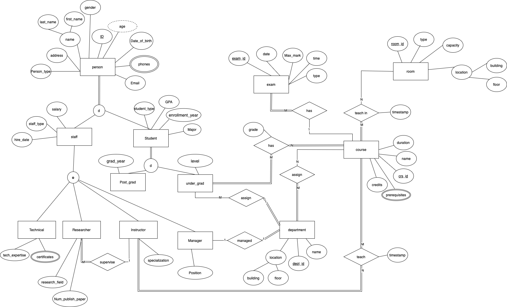

# Data-Management-System-for-a-University-Case-Study
## Overview

This project is a Data Management System designed for a university case study. It provides a structured database schema and management system to handle essential university operations, including student enrollment, course management, faculty assignments, and grading. The system ensures data integrity, scalability, and efficient query execution.

## Features
- **Student Management**: Enrollment, updates, and record maintenance.

- **Course Management**: Handling course details, prerequisites, and schedules.

- **Faculty Management**: Assigning instructors to courses.

- **Grading System**: Managing student grades and academic records.

- **Database Integrity**: Implementation of constraints, triggers, and indexes for efficiency.
## Technologies Used

- **Database**: Oracle Database

- **SQL Techniques**: PL/SQL, Triggers, Sequences, Package

- **Development Environment**: SQL Developer, Docker (for Oracle setup)

- **BashScripting**: backup database , monitoring

- **Version Control**: Git & GitHub

## 1- Database Design
**Entity Relationship Diagram (ERD)**

-
**Data Mapping**
-
| Table Name | Columns | Description |
|---|---|---|
| **person** | <ul><li>**ID (NUMBER)**: Unique identifier for each person.</li><li>**first_name (varchar2)**: First name of the person.</li><li>**last_name (varchar2)**: Last name of the person.</li><li>**gender (char)**: gender of the person (M or F).</li><li>**address (varchar2)**: Address of the person.</li><li>**date_of_birth (date)**: Date of birth of the person.</li><li>**email (varchar2)**: Email address of the person.</li><li>**person_type (vahrchar2)**: Type of person (e.g., staff, student).</li></ul>	 | Stores basic information about all individuals in the system. |
| **person_phones** | <ul><li>**person_id (NUMBER):** Foreign key referencing the person table.</li><li>**phone (varchar2):** Phone number of the person.</li><li>**phone_type (varchar2):** Phone type of the person (e.g., 'Mobile', 'Home', 'Work') .</li></ul> | Stores the phone numbers associated with a person. |
| **person_staff** | <ul><li>staff_id (NUMBER): Foreign key referencing the person table.</li><li>salary (decimal): Salary of the staff member.</li><li>staff_type (varchar2): Type of staff (e.g., technical, researcher, instructor, manager, or other for non specific type).</li><li>hire_date (date): Date when the staff member was hired.</li></ul>	 | Stores information specific to staff members, including their salary, type, and hire date. |
| **person_staff_technical** | <ul><li>**technical_id (NUMBER):** Foreign key referencing the person table.</li><li>**tech_expertise (varchar2):** Technical expertise of the staff member.(e.g., Networking, Lab Maintenance, IT Support)</li></ul> | Stores technical expertise details for technical staff. |
| **person_staff_technical_certificates** | <ul><li>**technical_id (NUMBER):** Foreign key referencing the person table.</li><li>**certificate (varchar2):** Name or description of the certificate.</li></ul> | Stores certificates held by technical staff. |
| **person_staff_instructor** | <ul><li>**person_id (NUMBER):** Foreign key referencing the person table.</li><li>**specialization (varchar2):** Area of specialization of the instructor.</li></ul> | Stores the specialization of instructors. |
| **person_staff_researcher** | <ul><li>**researcher_id (NUMBER):** Foreign key referencing the person table.</li><li>**research_field (varchar2):** Research field of the researcher.</li><li>**num_publish_paper (NUMBER):** Number of published research papers.</li><li>**supervisor_id (NUMBER):** Foreign key referencing the person table (supervisor of the researcher) and the supervisor is an **instractor**.</li></ul> | Stores information specific to researchers, including their research field, number of published papers, and supervisor. |
| **person_staff_manager** | <ul><li>**manager_id (NUMBER):** Foreign key referencing the person table.</li><li>**position (varchar2):** Position of the manager.(e.g., Dean, Department Head, Administrator)</li></ul> | Stores the position of managers. |
| **person_student** | <ul><li>**student_id (NUMBER):** Foreign key referencing the person table.</li><li>**major (varchar2):** Major of the student.</li><li>**GPA (decimal) from 0.0 to 4.0:** Grade Point Average of the student.</li><li>**enrollment_year (NUMBER):** Year of enrollment of the student.</li><li>**student_type (varchar2):** Type of student (e.g., undergraduate, postgraduate).</li></ul> | Stores information specific to students, including their major, GPA, enrollment year, and student type. |
| **person_student_post** | <ul><li>**person_id (NUMBER):** Foreign key referencing the person table.</li><li>**graduation_year (NUMBER):** Year of graduation of the postgraduate student.</li></ul> | Stores the graduation year of postgraduate students. |
| **person_student_under** | <ul><li>**person_id (NUMBER):** Foreign key referencing the person table.</li><li>**level (varchar2):** Level of the undergraduate student (e.g., freshman, sophomore, Junior, Senior).</li></ul> | Stores the level of undergraduate students. |
| **department** | <ul><li>**department_id (NUMBER):** Unique identifier for each department.</li><li>**department_name (varchar2):** Name of the department.</li><li>**building (varchar2):** Building where the department is located.</li><li>**floor_num (NUMBER):** Floor of the department in the building.</li><li>**manager_id (NUMBER):** Foreign key referencing the person table (manager of the department).</li></ul> | Stores information about departments, including their name, location, and manager. |
| **course** | <ul><li>**course_id (NUMBER):** Unique identifier for each course.</li><li>**course_name (varchar2):** Name of the course.</li><li>**duration (NUMBER):** Duration of the course in days.</li><li>**credits (NUMBER):** Number of credits for the course.</li></ul> | Stores information about courses, including their name, duration, and credits. |
| **course_prerequisite** | <ul><li>**course_id (NUMBER):** Foreign key referencing the course table.</li><li>**prerequisite_id (NUMBER):** Foreign key referencing the course table (prerequisite course).</li></ul> | Stores information about prerequisites for courses. |
| **room** | <ul><li>**room_id (NUMBER):** Unique identifier for each room.</li><li>**capacity (NUMBER):** Capacity of the room.</li><li>**room_type (varchar2):** Type of room (e.g., classroom, lab).</li><li>**building (varchar2):** Building where the room is located.</li><li>**floor_num (NUMBER):** Floor of the room in the building.</li></ul> | Stores information about rooms, including their capacity, type, and location. |
| **exam** | <ul><li>**exam_id (NUMBER):** Unique identifier for each exam.</li><li>**exam_datetime (timestamp):** timestamp of the exam.</li><li>**exam_type (varchar2):** Type of exam (e.g., midterm, final).</li><li>**max_mark (NUMBER):** Maximum marks for the exam.</li><li>**course_id (NUMBER):** Foreign key referencing the course table.</li></ul> | Stores information about exams, including their date, time, type, maximum marks, and associated course. |
| **Instructor_course** | <ul><li>**instructor_id (NUMBER)**: Foreign key referencing the person table.</li><li>**course_id (NUMBER)**: Foreign key referencing the course table.</li><li>**instructor_course_datetime (timestamp)**: Date of the instruction.</li></ul> | Stores information about instructors teaching courses and the associated dates. |
| **department_student** | <ul><li>**student_id (NUMBER):** Foreign key referencing the person table.</li><li>**department_id (NUMBER):** Foreign key referencing the department table.</li></ul> | Stores information about students belonging to departments. |
| **department_course** | <ul><li>**dept_id (NUMBER):** Foreign key referencing the department table.</li><li>**course_id (NUMBER):** Foreign key referencing the course table.</li></ul> | Stores information about courses offered by departments. |
| **student_course** | <ul><li>**student_id (NUMBER):** Foreign key referencing the person table.</li><li>**course_id (NUMBER):** Foreign key referencing the course table.</li><li>**grade (decimal):** Grade obtained by the student in the course.</li></ul> | Stores information about students enrolled in courses and their grades. |
| **course_room** | <ul><li>**course_id (NUMBER):** Foreign key referencing the course table.</li><li>**room_id (NUMBER):** Foreign key referencing the room table.</li><li>**schedule_datetime (timestamp):** Date of the course scheduled in the room.</li></ul> | Stores information about courses scheduled in specific rooms and the associated dates. |


## Installation & Setup
### 1. Clone the Repository:
```
git clone https://github.com/MuhamedHekal/Data-Management-System-for-a-University-Case-Study.git
cd Data-Management-System-for-a-University-Case-Study
```
### 2. Setup Oracle Database (Using Docker):
```
# create your own folder to mount on it
docker run --name oracle_db -p 1521:1521 -e ORACLE_PWD=123 -v ./database:/opt/oracle/ container-registry.oracle.com/database/free:latest

```
## 3. Connect to the Database:

- Open SQL Developer or any SQL client. 
     - Connect using:

    - Host: `localhost`

    - Port: `1521`

    - User: `sys`

    - Password: `123`

    - SID/PDB: `FREE`
- run create_db_schema.sql to create schema and populate tables 