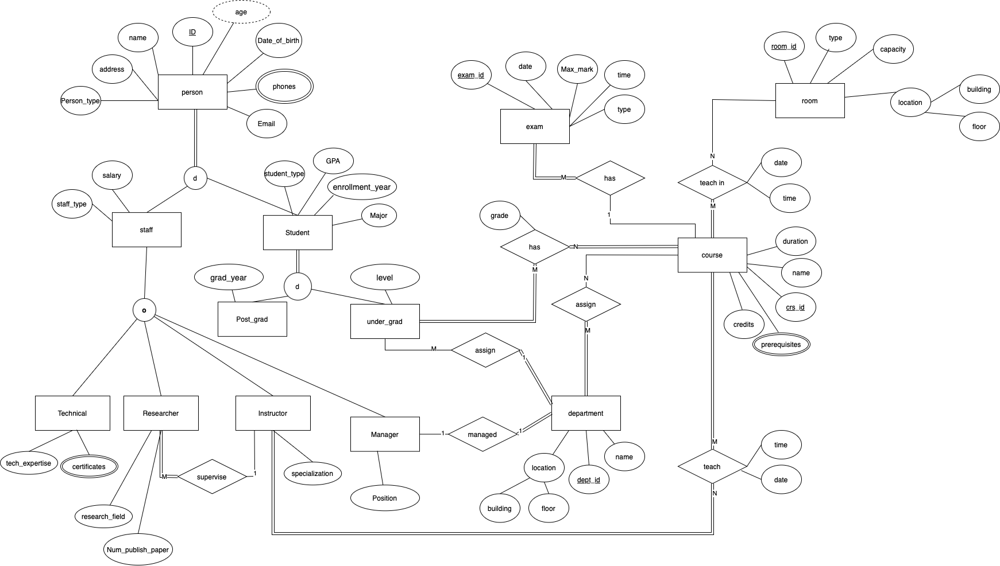

# Data-Management-System-for-a-University-Case-Study
## Overview

This project aims to develop a robust and efficient data management system for a university setting. Leveraging a combination of SQL, PLSQL, Advanced PLSQL, Red Hat Linux, and Bash scripting, the system will be designed to handle diverse data requirements across various university functions.
## 1- Database Design
**Entity Relationship Diagram (ERD)**

-
**Data Mapping**
-
| Table Name | Columns | Description |
|---|---|---|
| **person** | <ul><li>**ID (int):** Unique identifier for each person.</li><li>**name (varchar2):** Full name of the person.</li><li>**address (varchar2):** Address of the person.</li><li>**date_of_birth (date):** Date of birth of the person.</li><li>**email (varchar2):** Email address of the person.</li><li>**person_type (varchar2):** Type of person (e.g., staff, student).</li></ul> | Stores basic information about all individuals in the system. |
| **person_phones** | <ul><li>**person_id (int):** Foreign key referencing the person table.</li><li>**phone (varchar2):** Phone number of the person.</li></ul> | Stores the phone numbers associated with a person. |
| **person_staff** | <ul><li>**person_id (int):** Foreign key referencing the person table.</li><li>**salary (decimal):** Salary of the staff member.</li><li>**staff_type (varchar2):** Type of staff (e.g., technical, researcher, instructor, manager, and other **note** : the staff_type hold a JSON formate as a varchar2 because the staff is overlapping and the person might be an instractor and manager in the same time so we store this info as a JSON formate).</li></ul> | Stores information specific to staff members, including their salary and type. |
| **person_staff_technical** | <ul><li>**person_id (int):** Foreign key referencing the person table.</li><li>**tech_expertise (varchar2):** Technical expertise of the staff member.(e.g., Networking, Lab Maintenance, IT Support)</li></ul> | Stores technical expertise details for technical staff. |
| **person_staff_technical_certificates** | <ul><li>**person_id (int):** Foreign key referencing the person table.</li><li>**certificate (varchar2):** Name or description of the certificate.</li></ul> | Stores certificates held by technical staff. |
| **person_staff_researcher** | <ul><li>**person_id (int):** Foreign key referencing the person table.</li><li>**research_field (varchar2):** Research field of the researcher.</li><li>**num_publish_paper (int):** Number of published research papers.</li><li>**supervisor_id (int):** Foreign key referencing the person table (supervisor of the researcher) and the supervisor is an **instractor**.</li></ul> | Stores information specific to researchers, including their research field, number of published papers, and supervisor. |
| **person_staff_instructor** | <ul><li>**person_id (int):** Foreign key referencing the person table.</li><li>**specialization (varchar2):** Area of specialization of the instructor.</li></ul> | Stores the specialization of instructors. |
| **person_staff_manager** | <ul><li>**person_id (int):** Foreign key referencing the person table.</li><li>**position (varchar2):** Position of the manager.(e.g., Dean, Department Head, Administrator)</li></ul> | Stores the position of managers. |
| **person_student** | <ul><li>**person_id (int):** Foreign key referencing the person table.</li><li>**major (varchar2):** Major of the student.</li><li>**GPA (decimal) from 0.0 to 4.0:** Grade Point Average of the student.</li><li>**enrollment_year (int):** Year of enrollment of the student.</li><li>**student_type (varchar2):** Type of student (e.g., undergraduate, postgraduate).</li></ul> | Stores information specific to students, including their major, GPA, enrollment year, and student type. |
| **person_student_post** | <ul><li>**person_id (int):** Foreign key referencing the person table.</li><li>**graduation_year (int):** Year of graduation of the postgraduate student.</li></ul> | Stores the graduation year of postgraduate students. |
| **person_student_under** | <ul><li>**person_id (int):** Foreign key referencing the person table.</li><li>**level (varchar2):** Level of the undergraduate student (e.g., freshman, sophomore, Junior, Senior).</li></ul> | Stores the level of undergraduate students. |
| **department** | <ul><li>**dept_id (int):** Unique identifier for each department.</li><li>**name (varchar2):** Name of the department.</li><li>**building (varchar2):** Building where the department is located.</li><li>**floor (int):** Floor of the department in the building.</li><li>**manager_id (int):** Foreign key referencing the person table (manager of the department).</li></ul> | Stores information about departments, including their name, location, and manager. |
| **course** | <ul><li>**crs_id (int):** Unique identifier for each course.</li><li>**name (varchar2):** Name of the course.</li><li>**duration (int):** Duration of the course in days.</li><li>**credits (int):** Number of credits for the course.</li></ul> | Stores information about courses, including their name, duration, and credits. |
| **course_prerequisite** | <ul><li>**crs_id (int):** Foreign key referencing the course table.</li><li>**prerequisite_id (int):** Foreign key referencing the course table (prerequisite course).</li></ul> | Stores information about prerequisites for courses. |
| **room** | <ul><li>**room_id (int):** Unique identifier for each room.</li><li>**capacity (int):** Capacity of the room.</li><li>**type (varchar2):** Type of room (e.g., classroom, lab).</li><li>**building (varchar2):** Building where the room is located.</li><li>**floor (int):** Floor of the room in the building.</li></ul> | Stores information about rooms, including their capacity, type, and location. |
| **exam** | <ul><li>**exam_id (int):** Unique identifier for each exam.</li><li>**date (date):** Date of the exam.</li><li>**time (time):** Time of the exam.</li><li>**type (varchar2):** Type of exam (e.g., midterm, final).</li><li>**max_mark (int):** Maximum marks for the exam.</li><li>**crs_id (int):** Foreign key referencing the course table.</li></ul> | Stores information about exams, including their date, time, type, maximum marks, and associated course. |
| **Instructor_course** | <ul><li>instructor_id (int): Foreign key referencing the person table.</li><li>crs_id (int): Foreign key referencing the course table.</li><li>date (date): Date of the instruction.</li><li>time (time): Time of the instruction.</li></ul> | Stores information about instructors teaching courses and the associated dates. |
| **department_student** | <ul><li>**student_id (int):** Foreign key referencing the person table.</li><li>**dept_id (int):** Foreign key referencing the department table.</li></ul> | Stores information about students belonging to departments. |
| **department_course** | <ul><li>**dept_id (int):** Foreign key referencing the department table.</li><li>**crs_id (int):** Foreign key referencing the course table.</li></ul> | Stores information about courses offered by departments. |
| **student_course** | <ul><li>**student_id (int):** Foreign key referencing the person table.</li><li>**crs_id (int):** Foreign key referencing the course table.</li><li>**grade (decimal):** Grade obtained by the student in the course.</li></ul> | Stores information about students enrolled in courses and their grades. |
| **course_room** | <ul><li>**crs_id (int):** Foreign key referencing the course table.</li><li>**room_id (int):** Foreign key referencing the room table.</li><li>**date (date):** Date of the course scheduled in the room.</li></ul> | Stores information about courses scheduled in specific rooms and the associated dates. |

